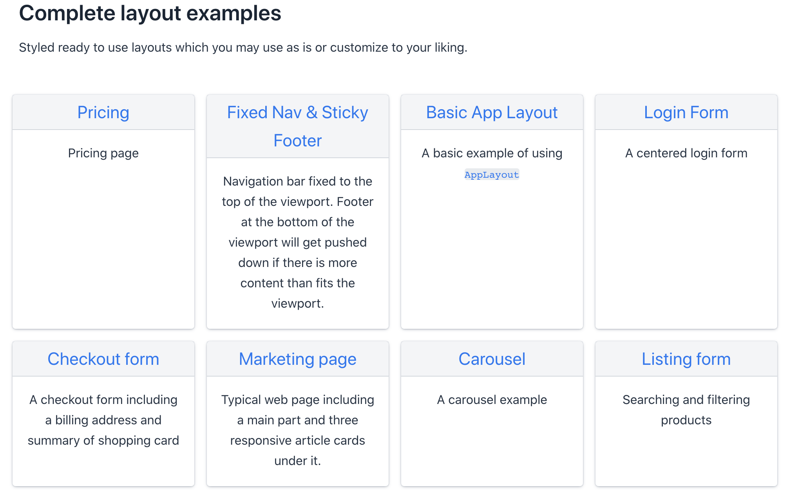

# Layout Examples for Vaadin 14

This project was created from https://start.vaadin.com. It's a fully working Vaadin application that you continue developing locally.
It has all the necessary dependencies and files to help you get going. 

The project is a standard Maven project, so you can import it to your IDE of choice. You'll need to have Java 8+ and Node.js 10+ installed.

To run from the command line, use `mvn jetty:run` and open [http://localhost:8080](http://localhost:8080) in your browser.

## Project structure

- `MainView.java` in `src/main/java` contains the navigation setup. It uses [App Layout](https://vaadin.com/components/vaadin-app-layout).
- `views` package in `src/main/java` contains the server-side Java views of your application.
- `views` folder in `frontend/src/` contains the client-side JavaScript views of your application.

## What next?

[vaadin.com](https://vaadin.com) has lots of material to help you get you started:

 - Follow the tutorials in [vaadin.com/tutorials](https://vaadin.com/tutorials). Especially [vaadin.com/tutorials/getting-started-with-flow](https://vaadin.com/tutorials/getting-started-with-flow) is good for getting a grasp of the basic Vaadin concepts.
 - Read the documentation in [vaadin.com/docs](https://vaadin.com/docs).
 - For a bigger Vaadin application example, check out the Full Stack App starter from [vaadin.com/start](https://vaadin.com/start).
